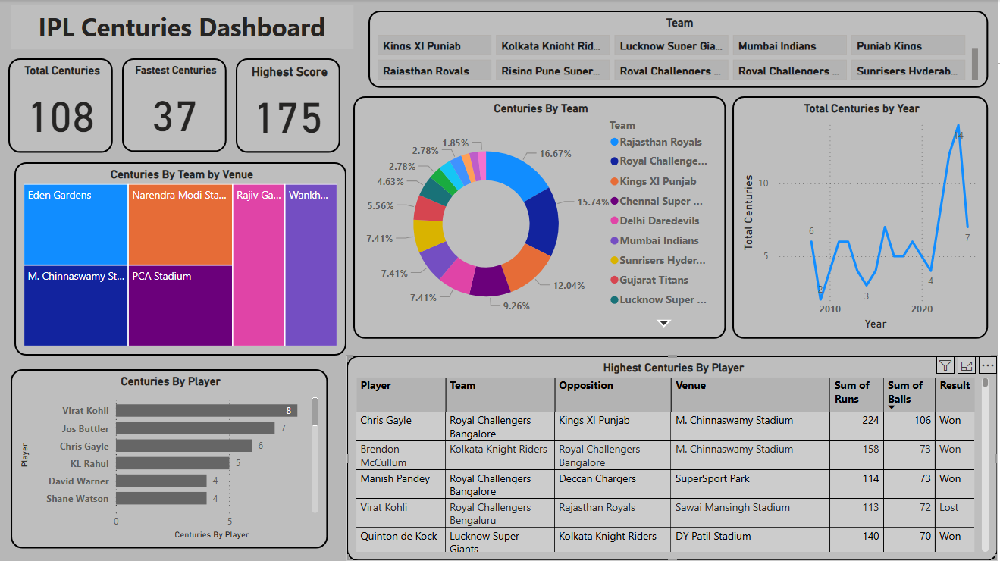

# 🏏 IPL Centuries Analysis – Power BI Dashboard

## 📌 Project Overview
This project analyzes **centuries scored in the Indian Premier League (IPL)** to identify
patterns in player performance, strike rate, teams, venues, and match results.
The dashboard is built using **Power BI** with data prepared in **Excel**.

---

## 📂 Dataset Details
The dataset includes IPL centuries with the following fields:
- Player
- Score
- Balls Faced
- Strike Rate
- Team
- Opposition
- Innings
- Venue
- City
- Match Date
- Match Result

---

## 🛠 Tools Used
- Microsoft Excel (Data Cleaning)
- Power BI (Dashboard & Visualization)
- GitHub (Project Hosting)

---

## 📊 Key Insights
- Players with highest number of IPL centuries
- Relationship between balls faced and strike rate
- Team-wise and venue-wise century distribution
- Impact of centuries on match results (Won/Lost)
- Innings-wise scoring patterns

---

## 🖼 Dashboard Preview

---

## 📁 Project Structure
IPL-Centuries-Analysis
│
├── data
│ └── IPL_Centuries_Data.xlsx
├── powerbi
│ └── IPL_Centuries_Dashboard.pbix
├── screenshots
│ └── IPL_Centuries-Dashboard.PNG
└── README.md

---

## 🚀 How to Use
1. Download the Excel dataset from the `data` folder
2. Open the `.pbix` file using Power BI Desktop
3. Interact with filters to explore players, teams, venues, and results

---

## 👤 Author
**Shubham Mandavkar**  
Aspiring Data Analyst | Excel | Power BI | SQL | Python  
📍 Mumbai, India
